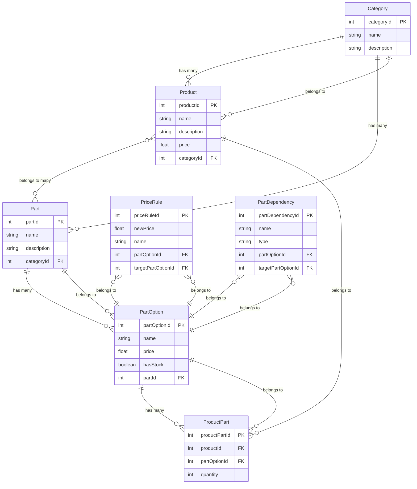

# Marcus' Bicycle Shop

## Project Setup
### Install
```
npm i
````

### Seeding Data
```
npm run seed
```

### Test local
Get total price base on selected options
```
npm run start:getTotalPrice
```

Get available parts base on selected option
```
npm run start:getAvailableOptions
```

### Start Console App
Run console app that demonstrates the functionality of the shop
```
npm start
```
Do take note that it has certain limitation especially on customizing bike e.g when selecting options for parts it will not prompt that the previously selected option contradicts the Part dependency

Normally on a web application you can just deselect and show an error when this happens


## Requirements
- currently selling bicycle parts but needs to be extendable so it can sell other sports related items such as skates, surfboards etc
- bikes are customizable, you have lots of options per parts of the bicycle
- some combinations of part options are prohibited and must be considered
    - you can exclude part options base on another part option
    - you can specify the part option that are available  given a part option
- some part options can be out of stock
- some combination of part options might make it more expensive
    - a part option can change price  base on another part option

## Data Model


### Categories
This contains the products that are available on the shop. Currently the shop only has bicycles but in the future the shop can expand to surfboards, scooters etc. Purpose of separating it into a different table is so that it can easily be added in the future without changing the tables

### Products
These are finished products that can act as a template which already contains all the part options that the user needs

### Parts
This contains the parts of the bicycle

### Part Options
This contains the options for the parts. Each of the parts contains the price and stock availability

### Price Rules
This table aims to solve the requirement wherein the price of certain parts changes depending on another part option that was picked by the user. The price mentioned in this table will override the price defined in part options if there is a match.

### Part Dependencies
This table aims to solve the requirement wherein some part options have compatibility with other part options. System can exclude or include certain part options on some parts.

### Product Parts
This is a junction table where we can define parts and options of the items in the Products table.

## Main User Actions
User can:
- view pre-made products and also parts options of bicycle
- see if parts/pre-made products are out of stock
- pick pre-made bicycle but change any parts associated with it so as long as it is compatible
- see the total price of customized bike

## Product Page
In the UI, Ill display all the products that are available as well as one last option to customize a bike.

The products will act as a template with preselected parts. Once they click a product they will see all the part options pre-selected. If they click the customize they will see all parts and they can pick the part options that they like for each part. After picking the user will be able to see the items picked per part and its price as well as total price.

To get the available options, the complication here is that the options changes depending on other part options. The Product Dependencies table aims to provide a means to resolve this. The basic logic is:
- get all the part options per part
- get all the dependencies base on selected options
- filter the parts base on dependency with the use of target parts option

Ive created a function for this to demonstrate how it works. You can run the script `npm run start:getAvailableOptions`

To get the price of the users' selection, the complication here is that the options' price changes depending on part options selected. The Price Rule table aims to resolve this. The basic logic is:
- get all the part options per part
- get all the price rules for the selected options
- for each of the selected options
    - check of its affected by the price rule
    - if its affected then override the price
    - add the price cumulatively

Ive created a function for this to demonstrate how it works. You can run the script `npm run start:getTotalPrice`

## Add to Cart
For this a User table may be needed and also a junction table similar to Product Parts. It will link the part, part options and user.

Ill be creating a new junction table similar to Product Parts. It will basically link the parts and part options.

### Administrative Workflows, Products and Pricing
- Add Category
    - If the business wants to expand, the admin can add another category such as surfboards, scooters
- Add Products
    - Normally people who are just starting in their bike hobby doesnt know much about bike parts. So admin can add a bike with preselected parts and part options  via the Product and Product Parts table.
- Add Parts
    - Admin can maybe add optional parts that like for example cellphone holder. Admin can just add this to Parts table
- Add Part Options
    - when there are a new set of rim colors, or chains, the admin can just add these in Part options table
- Add Price Rule
    - Admin can add an entry here so that when certain part options are picked the price for other part options changes
- Add Part Dependency
    - Admin can add entry here so thet when certain part options are picked the selection for other parts will include or exlude part options

I mentioned earlier that I created junction tables for Pricing Rule and Part Dependencies. The main logic for these table is that they have partOptionId and targetPartOptionId. So when a selectedOption matches the partOptionId then it will affect the targetOptionId either by changing price or being included or excluded as options for that part
