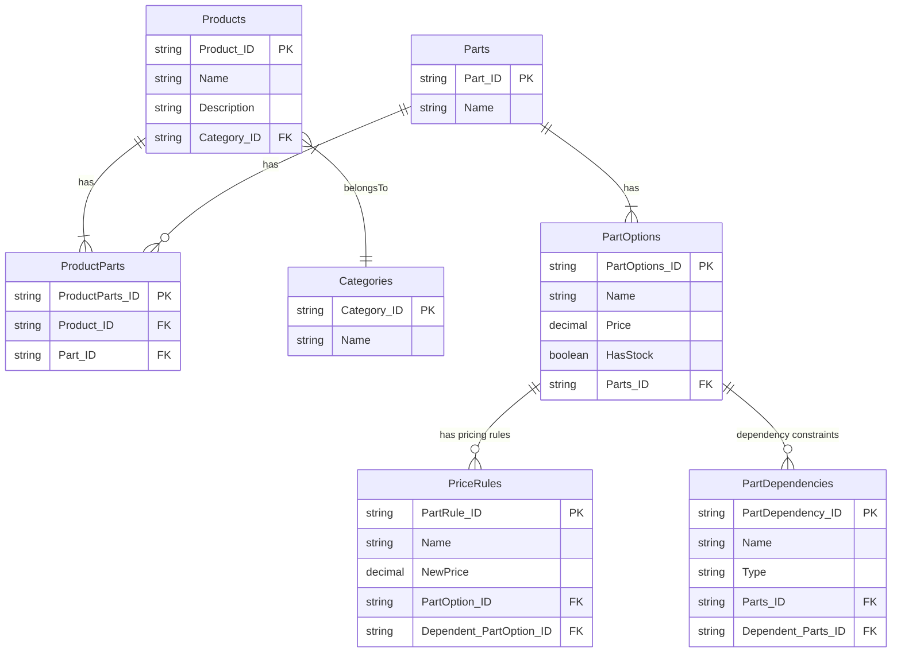
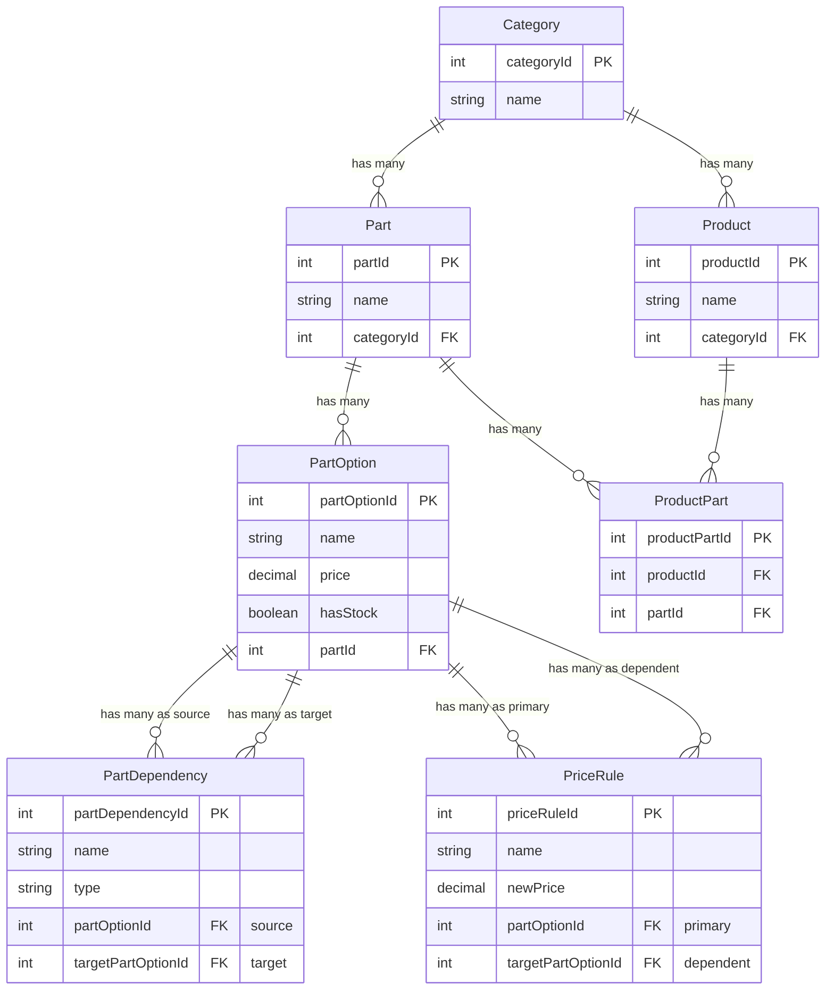

# Marcus' Bicycle Shop

## Requirements
- currently selling bicycle parts but needs to be extendable so it can sell other sports related items such as skates, surfboards etc
- bikes are customizable, you have lots of options per parts of the bicycle
- some combinations of part options are prohibited and must be considered
    - you can exclude part options base on another part option
    - you can specify the part option that are available  given a part option
- some part options can be out of stock
- some combination of part options might make it more expensive
    - a part option can change price  base on another part option

## Data Model

### Categories
This contains the products that are available on the shop. Currently the shop only has bicycles but in the future the shop can expand to surfboards, scooters etc. Purpose of separating it into a different table is so that it can easily be added in the future without changing the tables

### Products
These are finished products that can act as a template which already contains all the part options that the user needs

### Parts
This contains the parts of the bicycle

### Part Options
This contains the options for the parts. Each of the parts contains the price and stock availability

### Price Rules
This table aims to solve the requirement wherein the price of certain parts changes depending on another part option that was picked by the user. The price mentioned in this table will override the price defined in part options if there is a match.

### Part dependencies
This table aims to solve the requirement wherein some part options have compatibility with other part options. System can exclude or include certain part options on some parts.

## Main User Actions
User can:
- view pre-made products and also parts options of bicycle
- see if parts/pre-made products are out of stock
- pick pre-made bicycle but change any parts associated with it so as long as it is compatible
- see the total price of customized bike

## Product Page
In the UI, Ill display all the products that are available as well as one last option to customize a bike.

The products will act as a template with preselected parts. Once they click a product they will see all the part options pre-selected. If they click the customize they will see all parts and they can pick the part options that they like for each part

To get available options, essentially Im thinking to
- get all the parts, part options per part, and part dependency
- in the ui, whenever the user selects a part option ill run it through the part dependency to update the list of the other part that might be affected
- if a user tries to change a selected part it will check the part dependency again and ensure that the new selected item is permitted otherwise should display validation error

To get price on parts option:
- get parts option and price rules
- check price rules if there are selected options that match the dependency parts option and check if the parts option is present in the selection as well so we can use the new price

